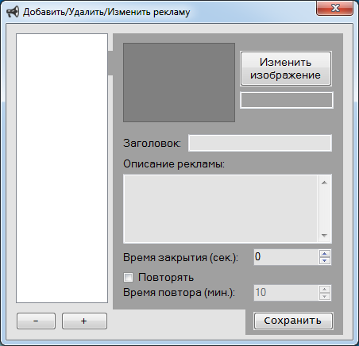

# Это реклама
Нет, это не реклама, а проект реклама. Да не проект рекламы, а проект с названием "реклама".
Это такая штука, которая нужно абсолютно каждому пользователю компьтера... который сидит в Google.
С этим приложением реклама выходит за рамки браузера - теперь она прямо на вашем ПК! Сотни девушек в вашем райо... а, нет, это другое.
В общем, эта программа... и google... у них много общего...

Скажу по секрету, я написал её случайно: дело в том, что как-то после чтения одной из статей мне захотелось поработать в google, и друг я включаю ПК... 
Первое что я вижу - visual studio. Так захотелось установить в неё пакеты для разработки на JS... 
Знали бы вы как я испугался: внезапно полюбить JS - это всё равно что уснуть нормальным, а проснуться гнилым... В общем, я от ужаса сдержал этот порыв. Но что-то сделать хотелось.
Хотелось написать программу, но почему-то на каком-то дурацко-тормознутом языке. Какое счастье, что на компьютере у меня не было ничего связанного с Java.
Волей-неволей я убедил себя в том, что писать на отстойных языках не нужно и, взяв себя в руки, приступил к написанию на VB. Кто-то скажет, что VB - отстой, ну а я скажу, что это лучше, чем Java.
Почему-то в этот раз мне хотелось начать писать приложение ещё до того, как я пойму, чего именно хочу... Впервые такое, ну чтож, можно попробовать. Написал я программу быстро: получился баннер на весь экран, который предлагал купить фарфоровый аквариум на aliexpress. Увы, оказалось, баннер не был исправен, и во вторую попытку запуска выдал мне BSOD. Я изумился и стал фиксить. 
После фикса поведение программы стало более предсказуемым - BSOD стал появляться при каждом запуске.
После долгого дебага пришлось отказаться от некоторых частей программы, потому что я почему-то решил закончить программу за 1 день...
Как бы я не пытался сгладить рекламное направление, оно почему-то всё равно давало о себе знать. 
В итоге получилась программа "*advertisement*" - компромисс между высококлассным умением писать программы и google. Со странным самочуствием я пошёл спать, надеясь забыть приключившееся в этот день. Как же хорошо было проснуться на следующее утро нормальным и с радостью писать на плюсах :-)

# Использование
Это portable-программа, в установке не нуждается, прописывает себя в автозапуск самостоятельно.
Чтобы настроить, используйте файл "*Advertisement Settings.ls3*". Это что-то вроде "панели админа". Взять этот файл можно в папке *advertisement\bin*. Содержимое файла менять не нужно. Через некоторое время (около минуты) файл будет удалён и откроется окно настроек. Выглядеть оно будет следующим образом:

Снизу слева открывшегося окна находятся кнопки добавления (+) и удаления (-) рекламы. После нажатия на кнопку "+" и ввода внутреннего имени, выберите появившийся в списке элемент и заполняйте наддыми область справа. После заполнения необходимо нажать на кнопку "Сохранить". 

В области справа можно (и рекомендуется) добавить рекламной записи картинку. Заголовок будет отображаться вверху окна с рекламой. Описание будет отображаться под картинкой. Время закрытия - любимая тема рекламщиков - это минимальное время просмотра рекламы, т.е. пропустить рекламу сразу будет нельзя. Время повтора - не менее любимая тема - это то время, через которой будт выплывать окно с рекламой. Для каждой рекламы это время может быть разным.

P.S. Было бы весьма иронично, если бы эта программа выплыла на компьютере сотрудника google.